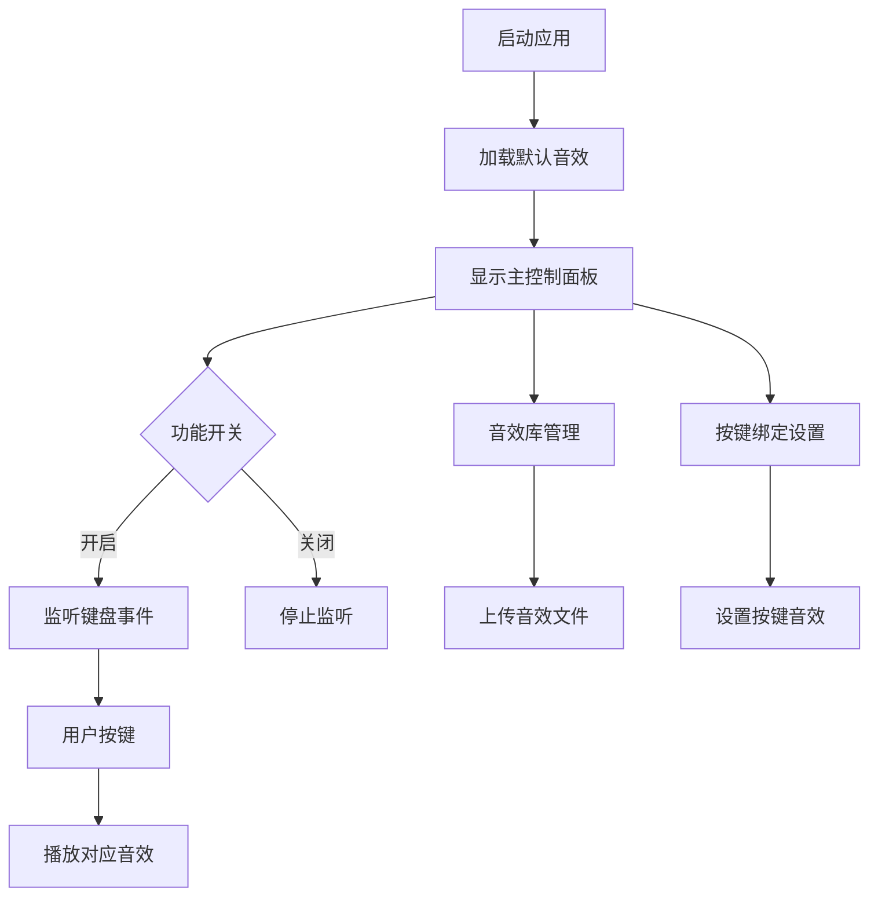

## 1. 产品概述
Noisy Keyboard是一款macOS平台的键盘音效工具，通过检测用户按键操作播放对应的音效，模拟机械键盘打字体验。

产品目标用户为喜欢机械键盘音效但使用薄膜键盘的用户，提供个性化的键盘音效体验。

## 2. 核心功能

### 2.1 用户角色
| 角色 | 注册方式 | 核心权限 |
|------|----------|----------|
| 普通用户 | 无需注册 | 使用音效功能、上传音效文件、自定义按键绑定 |

### 2.2 功能模块
应用包含以下核心功能页面：
1. **主控制面板**: 功能开关、音效设置、按键绑定管理
2. **音效库管理**: 音效文件上传、预览、删除
3. **按键绑定设置**: 为单个按键设置音效

### 2.3 页面详情
| 页面名称 | 模块名称 | 功能描述 |
|----------|----------|----------|
| 主控制面板 | 功能开关 | 开启/关闭键盘音效功能 |
| 主控制面板 | 当前音效设置 | 显示当前使用的音效文件，支持快速切换 |
| 主控制面板 | 系统状态 | 显示应用运行状态、音量控制 |
| 音效库管理 | 音效列表 | 显示所有已上传的音效文件，支持预览和删除 |
| 音效库管理 | 音效上传 | 支持选择MP3格式文件上传，显示上传进度 |
| 按键绑定设置 | 按键映射表 | 可视化显示键盘布局，显示每个按键当前绑定的音效 |
| 按键绑定设置 | 按键编辑 | 为单个按键选择音效文件，支持批量设置 |

## 3. 核心流程

### 3.1 用户使用流程
1. 用户启动应用
2. 应用自动加载默认音效到所有按键
3. 用户可选择开启/关闭音效功能
4. 用户可上传自定义音效文件
5. 用户可为特定按键设置个性化音效
6. 用户按键时播放对应音效

### 3.2 音效管理流程
1. 用户进入音效库管理页面
2. 点击上传按钮选择MP3文件
3. 系统验证文件格式并保存
4. 音效文件显示在音效列表中
5. 用户可预览或删除音效文件

### 3.3 按键绑定流程
1. 用户进入按键绑定设置页面
2. 选择要设置的按键
3. 从音效库中选择音效文件
4. 保存按键绑定设置
5. 测试按键音效效果

## 4. 用户界面设计

### 4.1 设计风格
- **主色调**: 深灰色(#2C3E50)配合橙色(#E67E22)强调色
- **按钮风格**: 圆角矩形按钮，扁平化设计
- **字体**: 系统默认字体，标题14px，正文12px
- **布局**: 卡片式布局，左右分栏设计
- **图标**: 使用SF Symbols图标库，保持macOS原生风格

### 4.2 页面设计概述
| 页面名称 | 模块名称 | UI元素 |
|----------|----------|--------|
| 主控制面板 | 功能开关 | 大型切换开关，绿色表示开启，灰色表示关闭 |
| 主控制面板 | 当前音效设置 | 下拉选择框显示音效列表，包含预览按钮 |
| 主控制面板 | 系统状态 | 状态指示灯，音量滑块控制 |
| 音效库管理 | 音效列表 | 表格形式显示，包含文件名、大小、上传时间、操作按钮 |
| 音效库管理 | 音效上传 | 拖拽区域或文件选择按钮，显示上传进度条 |
| 按键绑定设置 | 按键映射表 | 可视化键盘布局，按键显示当前绑定音效名称 |
| 按键绑定设置 | 按键编辑 | 弹出式选择器，显示音效预览 |

### 4.3 响应式设计
- 桌面优先设计，支持macOS 10.15及以上版本
- 主窗口大小: 800x600像素，支持最小化到菜单栏
- 支持Retina显示屏，图标和界面元素自动缩放
- 支持深色模式和浅色模式自动切换