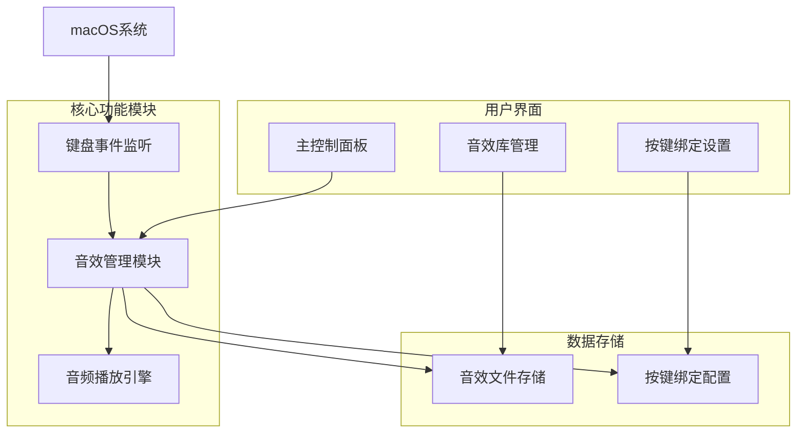

## 1. 架构设计



## 2. 技术描述

### 2.1 核心技术栈
- **开发语言**: Python 3.9+
- **项目依赖管理**: UV (Python包管理工具)
- **GUI框架**: PyQt6 (跨平台桌面应用开发)
- **音频处理**: PyAudio + PyDub (音频播放和处理)
- **键盘监听**: pynput (全局键盘事件监听)
- **系统托盘**: PyQt6系统托盘支持

### 2.2 依赖包列表
```
pyqt6>=6.5.0
pynput>=1.7.6
pyaudio>=0.2.11
pydub>=0.25.1
playsound>=1.3.0
appdirs>=1.4.4
```

## 3. 模块设计

### 3.1 核心模块
| 模块名称 | 功能描述 | 主要类/函数 |
|----------|----------|-------------|
| 键盘监听模块 | 监听全局键盘事件 | `KeyboardListener`, `on_key_press()` |
| 音效管理模块 | 管理音效文件和播放 | `SoundManager`, `play_sound()` |
| 按键绑定模块 | 管理按键与音效的映射 | `KeyBindingManager`, `get_key_sound()` |
| 配置管理模块 | 保存和加载应用配置 | `ConfigManager`, `save_config()` |
| 用户界面模块 | 提供图形用户界面 | `MainWindow`, `SoundLibraryDialog` |

### 3.2 文件结构
```
noisy_keyboard/
├── main.py                 # 主程序入口
├── core/
│   ├── __init__.py
│   ├── keyboard_listener.py    # 键盘事件监听
│   ├── sound_manager.py        # 音效管理
│   ├── key_binding.py          # 按键绑定管理
│   └── config_manager.py       # 配置文件管理
├── ui/
│   ├── __init__.py
│   ├── main_window.py          # 主窗口界面
│   ├── sound_library.py        # 音效库管理界面
│   └── key_binding_dialog.py   # 按键绑定设置界面
├── resources/
│   ├── click_keyboard.mp3 # 默认音效文件
│   └── icon.png               # 应用图标
├── config/
│   ├── settings.json          # 应用设置
│   └── key_bindings.json      # 按键绑定配置
└── requirements.txt          # 项目依赖
```

## 4. 数据模型

### 4.1 配置数据结构
```json
{
  "settings": {
    "enabled": true,
    "volume": 0.8,
    "default_sound": "click_keyboard.mp3",
    "minimize_to_tray": true,
    "auto_start": false
  },
  "sound_library": [
    {
      "id": "sound_001",
      "filename": "click_keyboard.mp3",
      "path": "resources/click_keyboard.mp3",
      "size": 1048576,
      "upload_time": "2024-01-01 12:00:00"
    }
  ],
  "key_bindings": {
    "a": "sound_001",
    "b": "sound_001",
    "c": "sound_001"
  }
}
```

### 4.2 按键绑定规则
- 支持标准键盘按键 (a-z, 0-9, 功能键等)
- 支持组合键绑定 (如 Ctrl+C, Cmd+V)
- 支持特殊按键 (空格、回车、退格等)
- 默认所有按键绑定到同一音效文件

## 5. 核心算法

### 5.1 键盘事件处理
```python
def on_key_press(key):
    """处理键盘按下事件"""
    try:
        # 获取按键字符
        key_char = get_key_character(key)
        
        # 查找按键绑定的音效
        sound_id = key_bindings.get(key_char, default_sound)
        
        # 播放音效
        if enabled and sound_id:
            play_sound(sound_id, volume)
            
    except Exception as e:
        log_error(f"键盘事件处理失败: {e}")
```

### 5.2 音效播放控制
```python
def play_sound(sound_id, volume=1.0):
    """播放指定音效"""
    sound_info = sound_library.get(sound_id)
    if sound_info and os.path.exists(sound_info['path']):
        # 加载音频文件
        audio = AudioSegment.from_mp3(sound_info['path'])
        
        # 调整音量
        audio = audio + (20 * log10(volume))
        
        # 播放音频
        play(audio)
```

## 6. 系统架构

### 6.1 应用启动流程
1. 初始化配置管理器，加载用户设置
2. 创建音效管理器，加载音效库
3. 创建按键绑定管理器，加载绑定配置
4. 初始化音频播放引擎
5. 启动键盘事件监听器
6. 显示主用户界面
7. 最小化到系统托盘（可选）

### 6.2 系统资源管理
- **内存管理**: 音效文件按需加载，避免内存溢出
- **文件管理**: 音效文件存储在用户目录，支持自动清理
- **性能优化**: 音频播放使用异步方式，不影响键盘响应
- **错误处理**: 完善的异常处理和日志记录

## 7. 部署方案

### 7.1 开发环境搭建
```bash
# 安装UV包管理器
curl -LsSf https://astral.sh/uv/install.sh | sh

# 创建虚拟环境
uv venv

# 安装依赖
uv pip install -r requirements.txt

# 运行应用
python main.py
```

### 7.2 打包发布
- 使用PyInstaller打包为macOS应用
- 创建.dmg安装包
- 支持自动更新机制
- 代码签名和公证（可选）

### 7.3 系统要求
- macOS 10.15 (Catalina) 或更高版本
- Python 3.9+ (开发环境)
- 至少100MB可用磁盘空间
- 音频输出设备